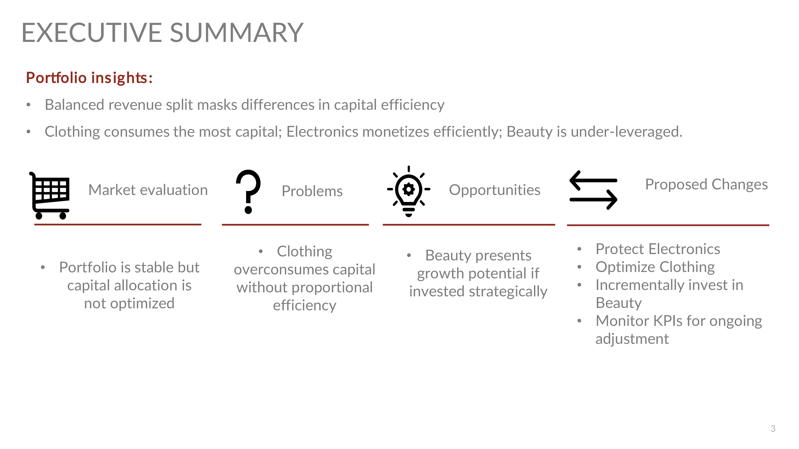
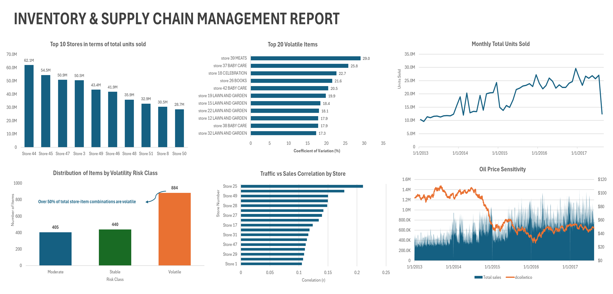

<!-- Section 1: Introduce yourself -->
## ABOUT ME

Hello! I'm **Temitope** 👋, a business & data analyst focused on bridging the gap between business needs and operational solutions. I examine organizational processes, systems, and data to uncover problems, opportunities, and requirements that shape performance and decision-making. My strength lies in translating complex analytical findings into clear, actionable recommendations that support leaders to make informed, high-impact decisions.

---

<!-- Section 2: What you do -->
## WHAT I DO

*I work at the intersection of business strategy, operations, and data analytics.*

** ✅ Business & Decision Analysis**  
I analyze business processes, performance data, and operational workflows to identify inefficiencies, risks, and growth opportunities that matter to decision-makers.

** ✅ Data-Driven Strategy & Insights**  
I apply analytical techniques to real-world datasets to support capital allocation, inventory optimization, and operational planning.

** ✅ Insight Communication**  
I translate technical analysis into structured insights, executive-ready narratives, and recommendations that drive clarity and action.

---

<!-- Section 3: Portfolio projects -->
## MY PORTFOLIO

*A selection of analytical projects I've worked on.*

---

### **Portfolio Strategy Case: Capital Allocation Using Transaction-Level Retail Data**

By analyzing transaction-level retail data across Electronics, Clothing, and Beauty categories, this project shows how targeted capital allocation can improve portfolio performance while maintaining overall revenue stability. The analysis focuses on revenue contribution, volume intensity, and efficiency to inform strategic reallocation decisions.

[Read More](https://medium.com/@temitopealo4/portfolio-strategy-case-capital-allocation-using-transaction-level-retail-data-8059a3671b04)

---

### **Inventory & Supply Chain Management: A Data-Driven Assessment Using Store Sales Time Series Data**

This project applies store-level sales time series analysis to identify demand concentration, volatility, and seasonal effects. The insights support smarter inventory prioritization, improved replenishment decisions, and more resilient supply chain planning.

[Read More](https://medium.com/@temitopealo4/inventory-supply-chain-management-a-data-driven-assessment-using-store-sales-time-series-data-77c0bb9899df)

---

<!-- Section 4: Contact -->
## CONTACT

*Let’s connect and explore how data can drive better decisions.*

- 📧 **Email:** [temitopealo4@gmail.com](mailto:temitopealo4@gmail.com)  
- 🌐 **Medium:** [medium.com/@temitopealo4](https://medium.com/@temitopealo4)  
- 💼 **Open to:** Business / Data Analyst roles and collaborative projects
