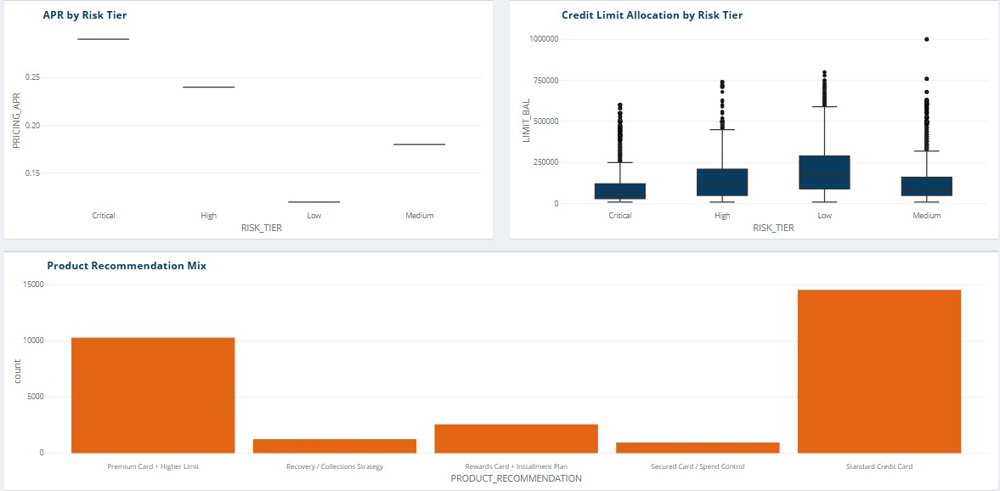
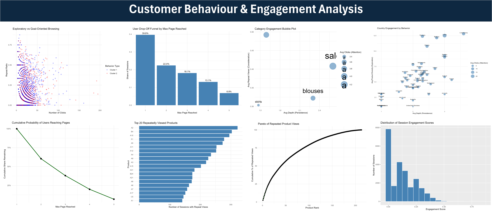
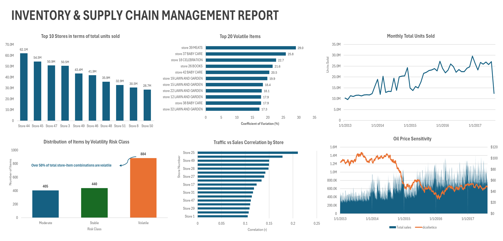
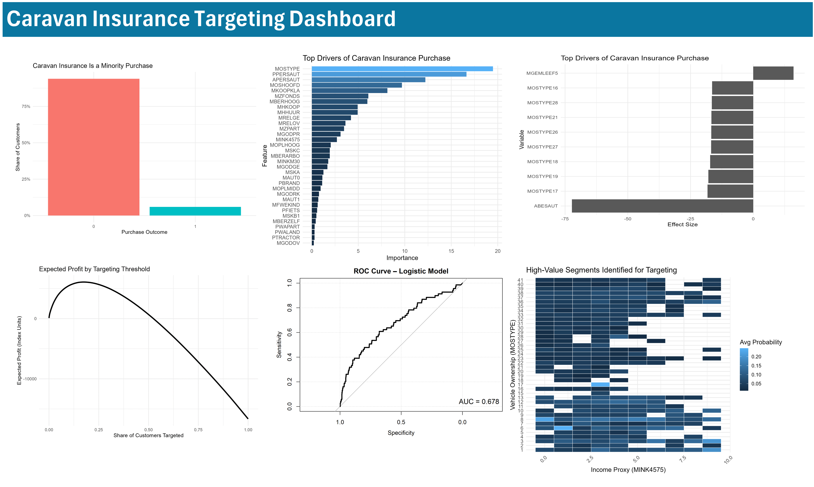
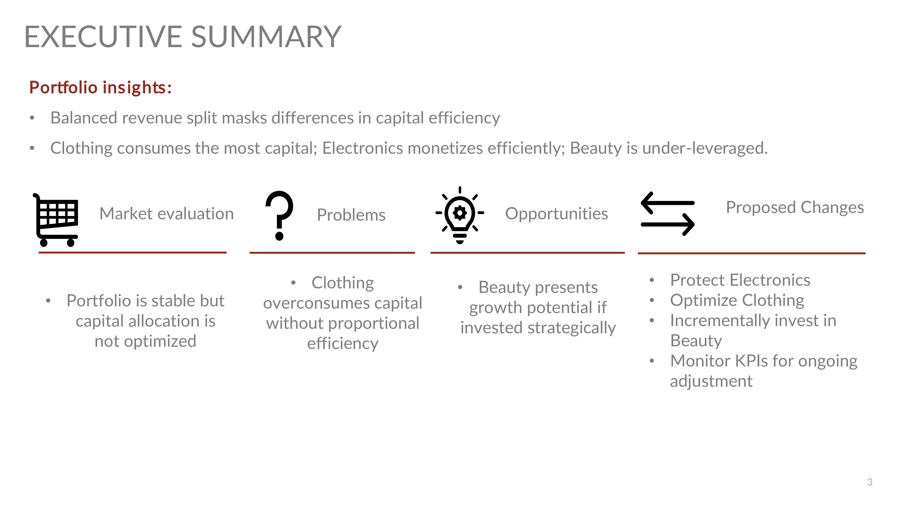

<!-- Section 1: Introduce yourself -->
## ABOUT ME

Hello! I'm **Temitope** 👋, a business & data analyst focused on bridging the gap between business needs and operational solutions. I examine organizational processes, systems, and data to uncover problems, opportunities, and requirements that shape performance and decision-making. My strength lies in translating complex analytical findings into clear, actionable recommendations that support leaders to make informed, high-impact decisions.

---

<!-- Section 2: What you do -->
## WHAT I DO

*I work at the intersection of business strategy, operations, and data analytics.*

**✅ Business & Decision Analysis**  
I analyze business processes, performance data, and operational workflows to identify inefficiencies, risks, and growth opportunities that matter to decision-makers.

**✅ Data-Driven Strategy & Insights**  
I apply analytical techniques to real-world datasets to support capital allocation, inventory optimization, and operational planning.

**✅ Insight Communication**  
I translate technical analysis into structured insights, executive-ready narratives, and recommendations that drive clarity and action.

---

<!-- Section 3: Portfolio projects -->
## MY PORTFOLIO

*A selection of analytical projects I've worked on.*

---

### **Building a Data-Driven Credit Strategy**

This project applies predictive credit scoring and portfolio segmentation to estimate borrower default risk, align product offerings, and calibrate pricing strategies. The insights support more effective risk management, targeted product allocation, and data-driven decision-making for optimized portfolio performance.

[Read More](https://medium.com/@temitopealo4/building-a-data-driven-credit-strategy-2d5068f54ac5)

<a href="03_analytics-and-insight/Integrated Credit Customer Strategy/Integrated Credit Customer Strategy.pdf">Download the full report here (PDF)</a>

---

### **Peeking Inside the Minds of Online Shoppers**

This project applies clickstream analysis to identify patterns of user engagement, browsing depth, and product category interaction. The insights support more effective content prioritization, targeted marketing strategies, and enhanced user experience design.

[Read More](https://medium.com/@temitopealo4/peeking-inside-the-minds-of-online-shoppers-db19ed12e7af)

<a href="03_analytics-and-insight/Customer Behavior & Engagement Analysis/Documentation_Customer Behavior & Engagement Analysis.pdf">Download the full report here (PDF)</a>

---

### **Inventory & Supply Chain Management: A Data-Driven Assessment Using Store Sales Time Series Data**

This project applies store-level sales time series analysis to identify demand concentration, volatility, and seasonal effects. The insights support smarter inventory prioritization, improved replenishment decisions, and more resilient supply chain planning.

[Read More](https://medium.com/@temitopealo4/inventory-supply-chain-management-a-data-driven-assessment-using-store-sales-time-series-data-77c0bb9899df)

<a href="03_analytics-and-insight/Inventory & Supply Chain Management Project/Documentation_Inventory Mgmt.pdf">Download the full report here (PDF)</a>

---

### **Caravan Insurance Buyer Analysis (COIL 2000)**

Analyzed the UCI COIL 2000 dataset to predict who is likely to purchase caravan insurance and understand the key drivers. Applied logistic regression, Lasso, and decision trees to identify high-probability buyers based on car ownership, lifestyle segments, household stability, and financial readiness. Insights highlight behavioral and socio-economic factors influencing insurance decisions, enabling targeted marketing and improved ROI.
[Read More](https://medium.com/@temitopealo4/caravan-insurance-buyer-analysis-coil-2000-78efa1f66bc1)

<a href="03_analytics-and-insight/Caravan Insurance Buyer Analysis/Documentation_Caravan Insurance Buyer Analysis.pdf">Download the full report here (PDF)</a>

---

### **Portfolio Strategy Case: Capital Allocation Using Transaction-Level Retail Data**

By analyzing transaction-level retail data across Electronics, Clothing, and Beauty categories, this project shows how targeted capital allocation can improve portfolio performance while maintaining overall revenue stability. The analysis focuses on revenue contribution, volume intensity, and efficiency to inform strategic reallocation decisions.

[Read More](https://medium.com/@temitopealo4/portfolio-strategy-case-capital-allocation-using-transaction-level-retail-data-8059a3671b04)

---
<!-- Section 4: Contact -->
## CONTACT

*Let’s connect and explore together.*

- 📧 **Email:** [temitopealo4@gmail.com](mailto:temitopealo4@gmail.com)  
- 🌐 **Medium:** [medium.com/@temitopealo4](https://medium.com/@temitopealo4)  
- 🧾 **View Curriculum Vitae:** <a href="0Temitope Emmanuel Alo.pdf">Temitope Emmanuel Alo</a>
- 💼 **Open to:** Business / Data Analyst roles and collaborative projects

